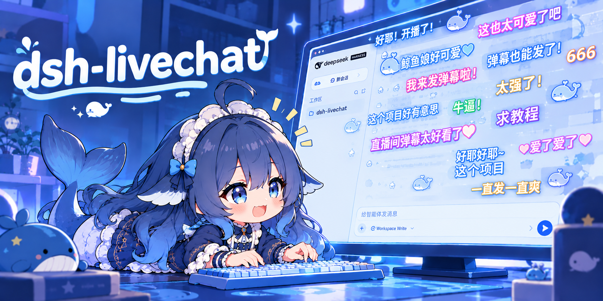
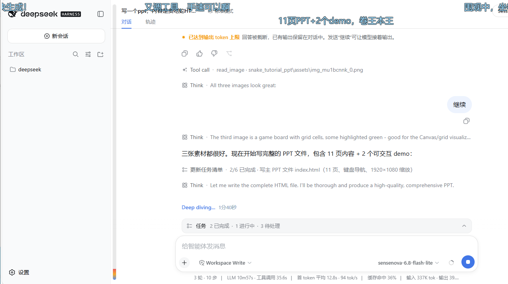

<div align="center">



# dsh-livechat

[](https://github.com/huashenglian/dsh-livechat)
[](#license)
[](https://github.com/deepseek-ai)

**Bilibili-style live-chat danmaku overlay for [DeepSeek Harness](https://github.com/deepseek-ai) (`dsh`) Web.**

Watch your agent work while a crowd of floating comments drifts across the conversation area — preset banter, optional LLM-generated quips, and your own messages too.

[中文](./README.md) · `English`

[Installation](#installation) · [Features](#features) · [Module docs](#module-documentation) · [Architecture](#architecture)

</div>

---

## Installation

The plugin is a **bundle**: it carries its own `cordis.patch.yml` and self-activates — one command, no manual patch editing.

```bash
# From a local directory
dsh plugin --profile web add ./dsh-livechat

# From npm (prebuilt — skips the allowBuilds approval)
dsh plugin --profile web add dsh-livechat

# From GitHub
dsh plugin --profile web add github:huashenglian/dsh-livechat

# From a packed tarball (pnpm pack / npm pack)
dsh plugin --profile web add ./dsh-livechat-0.2.0.tgz
```

Restart `dsh web`, then open <http://127.0.0.1:3080>. The danmaku overlay and a floating control ball appear over the conversation area.

> [!NOTE]
> The bundle ships its own `cordis.patch.yml` that self-activates the plugin (`insert id: livechat`). **Do not** add a duplicate `insert` entry in your profile patch — a second insert throws `duplicate loader entry id: livechat` at boot.

If you don't have the `dsh` CLI yet, you can run the web server directly:

```bash
npx @deepseek-ai/dsh web
```

### Quick health check

```bash
curl http://127.0.0.1:3080/api/danmaku/health
# {"ok":true,"name":"dsh-danmaku","version":"0.5.0"}
```

---

## What it does

When the agent sends a message, finishes a reply, calls a tool, or completes a task, a burst of danmaku floats across the conversation column — just like watching a livestream. Preset packs cover general / coding / casual vibes, and an optional LLM generates fresh, context-aware quips on a throttle. A draggable ball gives you quick controls; a settings card tunes everything.



*Live danmaku drifting over the conversation area while the agent works — multi-track, color-weighted, with the floating control ball (top-right).*

---

## Features

| Module | What it covers | Doc |
|---|---|---|
| **Overlay & rendering** | `shell.overlay` mount, DOM renderer, multi-track collision avoidance, anti-occlusion fade, render-backend chain | [overlay-and-rendering.md](docs/overlay-and-rendering.md) |
| **Presets & LLM** | Three preset packs, event-triggered sampling, fatigue dedup, optional LLM generation with smart/interval/tool-call wake modes, style templates | [presets-and-llm.md](docs/presets-and-llm.md) |
| **Interaction** | Draggable control ball, hover-pause, click-for-detail (copy / block / delete), user-sent danmaku, heat bar, welcome & task-done effects | [interaction.md](docs/interaction.md) |
| **Session pools** | Per-session `.jsonl` danmaku pools, history replay with decay + like-boost, archive/restore, in-app pool editor | [session-pools.md](docs/session-pools.md) |
| **Gift effects** | Asset store (file / SVG paste / GitHub / zip import), gift catalog with room-id refresh, binding + effect params, gift simulation (master switch off by default, zero room ids) | [gift-effects.md](docs/gift-effects.md) |
| **Configuration & API** | Settings card UI, every config field with defaults/range, full HTTP API reference | [configuration.md](docs/configuration.md) |

### Highlights

- **Three layouts**: roll (scroll), top-fixed, bottom-fixed — weighted per-config
- **Anti-occlusion**: overlay dims while you read, brightens when the crowd gets loud
- **LLM with safe fallback**: generation fails → silent preset fallback, no error popups
- **Per-session memory**: liked/replayed danmaku resurface; deleted sessions clean up automatically
- **Chromium-first**: tuned for Edge / Chrome; `translate3d`, page-`hidden` pause, on-screen cap
- **Paused items stay**: hover/detail-locked danmaku remain on screen until they resume and leave the range
- **Config survives restarts**: every save writes a local mirror (`$DSH_HOME/danmaku-config.json`) plus a minimal `danmaku:` section in `settings.yaml`; boot resolves mirror → settings → defaults, so a restart never resets your setup
- **Sessions by name**: the pool editor labels each pool with the real dsh session title instead of a truncated session id

---

## Architecture

```
dsh-livechat/
├─ package.json              # dsh.bundle + dsh.client declaration
├─ cordis.patch.yml          # self-activating bundle layer (insert id: livechat)
├─ lib/
│  ├─ index.js               # Host: settings namespace, session/event ring, HTTP routes, optional LLM
│  ├─ client.js              # Client: shell.overlay layer + settings card + DOM renderer + drag ball
│  ├─ presets.js             # Shared: preset packs, sampling, track-collision pure functions
│  └─ emoji-lib.js           # Emoji library: folders, imports (git/zip), weights, manifest
├─ tests/presets.test.js     # unit tests (node --test)
├─ docs/                     # module documentation (this README links out)
└─ assets/                   # demo screenshots & cover art
```

- **Host** (`lib/index.js`): registers the `danmaku` settings namespace, observes `session/event` into a trigger ring buffer, serves config/trigger/LLM/pool HTTP routes, and optionally generates danmaku via a configured LLM provider.
- **Client** (`lib/client.js`): a self-contained `window.__ModuleLoader__` factory — mounts a `pointer-events:none` overlay on `shell.overlay`, renders danmaku via DOM (`translate3d`), runs the drag ball, the settings card (`settings.plugin.item`), and the pool editor.
- **Shared** (`lib/presets.js`): preset packs, weighted sampling, layout/color picks, and track-collision checks — all pure functions, unit-tested.

The renderer interface aligns with the design doc (`参考文档/danmaku-renderer-design.md`). First release ships the **L5 DOM** backend; the architecture reserves a drop-in upgrade path to WebGL2 / Worker+WebGL2 without touching the business layer.

### Test

```bash
node --test tests/presets.test.js
```

---

## Uninstall

```bash
dsh plugin --profile web remove dsh-livechat
```

This removes the dependency and the bundle entry. If the server is still running, uninstall also wipes pool cache (`~/.dsh/danmaku-pools/`). You can also clear all pools from the pool editor’s red **Clear all pools** button.

---

## License

MIT
